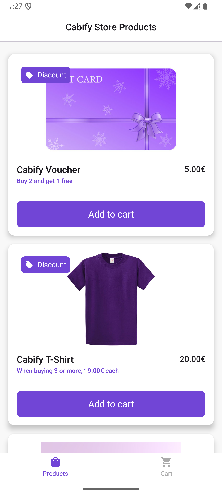
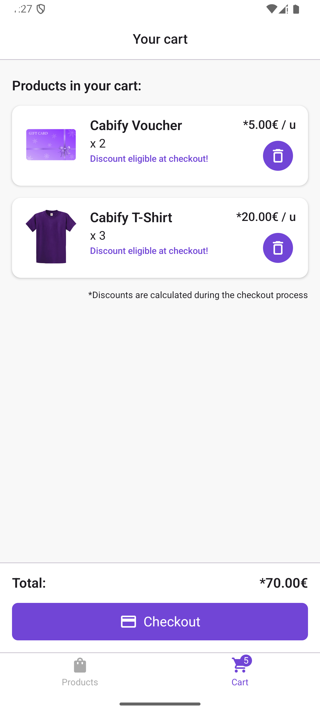
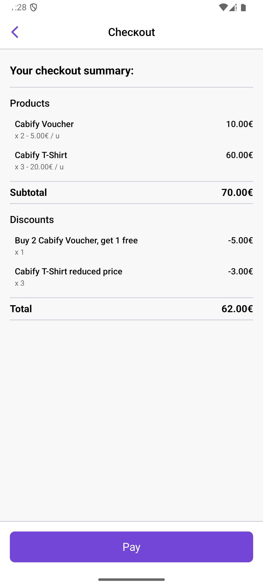

# Cabify Mobile Challenge

This is my solution to the mobile challenge of Cabify.

You can check the challenge details here: [Cabify Mobile Challenge](https://github.com/cabify/MobileChallenge)

Table of Contents
- [Requirements](#requirements)
- [Screens](#screens)
- [Setup](#setup)

## Requirements

UX:

- Be able to pick products from a list
- Understand what items are being purchased
- Checkout products to get the resulting price and the discounts applied

Code:

- Code should support discounts changing frequently
- Code must be written as production-ready code
- Written in Kotlin
  
## Screens

Based on the UX requirements, I have decided to choose to create three screens:

- **Products list:** Shows a list of products in the Cabify store, highlighting those with discounts with a tag and a promotional text. *(Requirement #1)*

- **Cart:** Displays the products that the user has added to the cart, along with the quantity, the price of the products and the total amount of the purchase (without discounts applied yet). *(Requirement #2)*

- **Checkout:** Displays the summary of the purchase, showing the user the products, with their quantity, total price and discounts applied. *(Requirement #3)*

#### Screenshots

|                      Products list                      |                      Cart                      |                      Checkout                      |
|:-------------------------------------------------------:|:----------------------------------------------:|:--------------------------------------------------:|
|  |  |  |

## Setup
To run this project:

1. Clone the repository.
2. Open the project in Android Studio.
3. Sync the project with Gradle files.
4. Build and run the project on an emulator or a connected device.
