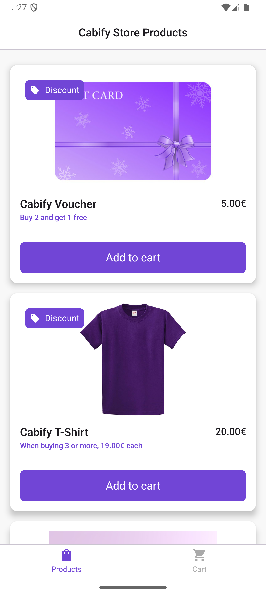
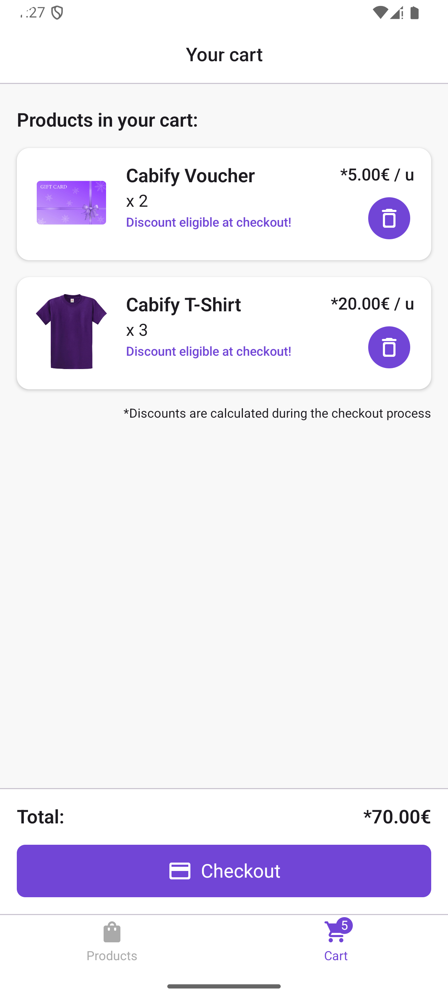

# Cabify Mobile Challenge

This is my solution to the mobile challenge of Cabify.

You can check the challenge details here: [Cabify Mobile Challenge](https://github.com/cabify/MobileChallenge)

**Table of Contents**
- [Requirements](#requirements)
- [Setup](#setup)
- [Screens](#screens)
- [Architecture](#architecture)
- [Modularization](#modularization)
- [Flavors](#flavors)
- [Tests](#tests)
- [Libraries](#libraries)
- [Additional comments](#additional-comments)

## Requirements

UX:

- Be able to pick products from a list
- Understand what items are being purchased
- Checkout products to get the resulting price and the discounts applied

Code:

- Code should support discounts changing frequently
- Code must be written as production-ready code
- Written in Kotlin

## Setup
To run this project:

1. Clone the repository.
2. Open the project in Android Studio.
3. Sync the project with Gradle files.
4. Build and run the project on an emulator or a connected device.

> [!IMPORTANT]  
> Since the discounts are not obtained remotely, I have simulated a remote data source that returns the discounts mentioned in the challenge details.

These discounts can be changed by modifying the code in [DemoDiscountsRemoteDataSourceImpl](core/network/src/main/kotlin/com/jargcode/storechallenge/core/network/discounts/DemoDiscountsRemoteDataSourceImpl.kt), but the following considerations must be taken into account:
- Discount **MUST** have a valid `productId`.
- Discount **MUST** have a valid type `FREE_ITEM | FIXED_PRICE`.
- Discount `minQuantity` **MUST** be greater than 0.
- If discount type is `FIXED_PRICE`, `fixedPrice` **MUST** be greater than 0.
  
If any of these cases is not met, the discount will not be visible.

## Screens

Based on the UX requirements, I have decided to choose to create three screens:

- **Products list:** Shows a list of products in the Cabify store, highlighting those with discounts with a tag and a promotional text. *(Requirement #1)*

- **Cart:** Displays the products that the user has added to the cart, along with the quantity, the price of the products and the total amount of the purchase (without discounts applied yet). *(Requirement #2)*

- **Checkout:** Displays the summary of the purchase, showing the user the products, with their quantity, total price and discounts applied. *(Requirement #3)*

#### Screenshots

|                      Products list                      |                      Cart                      |                      Checkout                      |
|:-------------------------------------------------------:|:----------------------------------------------:|:--------------------------------------------------:|
|  |  |  |

## Architecture

This project has been developed following CLEAN architecture and SOLID principles to ensure high maintainability, scalability, and testability.

The UI of my app has been built with `Compose`, using the `MVI pattern`. 

I really like Compose, I think it reduces development time a lot, especially when presenting lists, and it allows to reuse views in a super easy way.

For a more detailed explanation of how my project's presentation layer works, see [presentation layer doc](docs/presentation_layer.md)

## Modularization

The project is divided into multiple modules to enhance build performance, maintainability, and reusability.

For a more detailed explanation of each module, see [modularization doc](docs/modularization.md).

## Flavors

Because of the third consideration:

```
Be written as production-ready code. We would like you to build it in the same way as if you were going to publish to the store.
```

I wanted to replicate a production ready app, creating three flavors, `dev`, `stag` and `prod`. 

Each flavor is set up to have its own `dimension`, `applicationIdSuffix` and different `buildConfigField`.

This configuration can be seen in [Flavors](build-logic/convention/src/main/kotlin/com/jargcode/storechallenge/convention/Flavors.kt).

## Tests

I have included different types of Unit, UI and End to End (E2E) tests.

My main priority was to add tests to assert the desired result with the different examples given in the challenge detail.

Examples:

    Items: VOUCHER, TSHIRT, MUG
    Total: 32.50€

    Items: VOUCHER, TSHIRT, VOUCHER
    Total: 25.00€

    Items: TSHIRT, TSHIRT, TSHIRT, VOUCHER, TSHIRT
    Total: 81.00€

    Items: VOUCHER, TSHIRT, VOUCHER, VOUCHER, MUG, TSHIRT, TSHIRT
    Total: 74.50€

Tests that check this examples can be found in:
- [GetCheckoutSummaryUseCaseTest](core/testing/src/test/kotlin/com/jargcode/storechallenge/core/testing/checkout/useCase/GetCheckoutSummaryUseCaseTest.kt) (Unit test)
- [CreatePurchaseExamplesE2E](app/src/androidTest/java/com/jargcode/storechallenge/app/purchase/CreatePurchaseExamplesE2E.kt) (E2E test)

> [!NOTE]  
> For the E2E UI test, I have used Jake Wharton testing robot strategy.

I have also added Unit tests for each ViewModel, Unit test for the other two use cases and UI tests for each screen / component that I have considered important.

## Libraries

Libraries that I have used and why:

#### Dependency injection

- `Dagger Hilt`: Is the library I always use for DI in native Android applications because it's easy and very intuitive. I'm starting to try Koin in some KMP projects, but for now I'm sticking with Hilt.

#### Caching / Database

- `Room`: Easy to use, compatible with flows and corrutines, which makes it quite easy to do things like automatically display the badge when a product is added to the cart.

#### Reactive programming

- `Flows`: Native, coroutine based, easy to use, with a lot of operators included to perform different operations.

#### Network

- `Retrofit`: One of the most used libraries for network calls, I have been using this library for a long time and I am quite proficient with it. In spite of this I am starting to test Ktor in some projects.

#### Images

- `Coil`: It’s lightweight, uses coroutines for asynchronous loading, and integrates smoothly with Jetpack Compose.
Anyway, I always like to wrap the Coil `AsyncImage` composable, so if I start using other library in the future, I only have to modify one composable
(See   [Image](core/designsystem/src/main/kotlin/com/jargcode/storechallenge/core/designsystem/components/image/Image.kt)).

#### Serialization

- `Kotlinx serialization`: Straightforward way to serialize and deserialize data, compatibility with Retrofit. Needed for Compose native navigation routes.

#### Testing

- `Junit`: It is simple and straightforward, easy to configure each test.
  
- [`Assertk`](https://github.com/willowtreeapps/assertk): It is a library that I am using since recently, it comes loaded with many assertions that facilitate unit testing.
  
- [`Turbine`](https://github.com/cashapp/turbine): I think it is a totally necessary library if you use flows in your project. With turbine testing flows is very easy.

## Additional comments

The following are features and improvements I would have liked to include in this project. Some are areas I'm currently exploring.

Anyway, it's a matter of time that this list will have less and less things, because I love to learn new things and apply them to my projects :)!

- `JaCoCo`: I would have liked to incorporate JaCoCo to measure code coverage for UI tests.
  
- `CI/CD pipelines`: It's something I don't have too much knowledge at the moment, but it's a matter of time :)!
  
- `Code quality with Linting`: Adding linting would help enforce consistent code quality standards.
  
- `Static code analysis with` [`Detekt`](https://github.com/detekt/detekt): Using Detekt would improve static code analysis by ensuring each module respects dependencies
