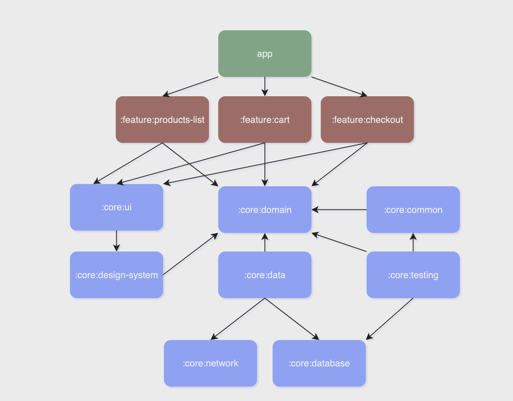

## App

<table>
  
  <tr>
   <td>
     <strong>Module</strong>
   </td>
   <td>
     <strong>Description</strong>
   </td>
  </tr>

  <tr>
   <td>
     <code>app</code>
   </td>
   <td>
     Brings everything together required for the app to function correctly. 
     All the navigation is in this module, so if in the future we want to change the navigation library, we only have to edit this module. 
     Also contais E2E tests.
   </td>
  </tr>

</table>

## Build logic

<table>
  
  <tr>
   <td>
     <strong>Module</strong>
   </td>
   <td>
     <strong>Description</strong>
   </td>
  </tr>

  <tr>
   <td>
     <code>convention</code>
   </td>
   <td>
     Each module that we add increases the complexity of the build configuration, and this can cause Gradle sync times to increase. Additionally, having multiple modules makes the Gradle setup more complex. 
     To address this, convention plugins can be used to extract reusable and composable build configurations into type-safe Kotlin code, helping streamline the setup.
   </td>
  </tr>

</table>

## Core

<table>
  
  <tr>
   <td>
     <strong>Module</strong>
   </td>
   <td>
     <strong>Description</strong>
   </td>
  </tr>

  <tr>
   <td>
     <code>:core:common</code>
   </td>
   <td>
     A utility module containing shared constants, helper functions, and utility classes that are used throughout the application. 
     In this case, only coroutine dispatchers.
   </td>
  </tr>

  <tr>
   <td>
     <code>:core:data</code>
   </td>
   <td>
     Manages the data sources and repositories within the app. This module serves as the main entry point for retrieving data from local or remote sources.
   </td>
  </tr>

  <tr>
   <td>
     <code>:core:database</code>
   </td>
   <td>
     Contains the database configurations, entities, and DAOs for local storage. This module handles all interactions with Room database. 
     Also, separating the database into another module helps reusability and separation of concerns.
   </td>
  </tr>

  <tr>
   <td>
     <code>:core:designsystem</code>
   </td>
   <td>
     App shared UI components, theme, colors, typography and styling resources that align with the app's design guidelines.
   </td>
  </tr>

  <tr>
   <td>
     <code>:core:domain</code>
   </td>
   <td>
     Manages business logic and use cases. This module contains the core application rules.
   </td>
  </tr>

  <tr>
   <td>
     <code>:core:network</code>
   </td>
   <td>
     Manages networking tasks, including API calls, request handling, and data transfer objects (DTOs) for remote communication. 
     This module ensures a clean separation of networking concerns and abstracts the underlying network library
   </td>
  </tr>

  <tr>
   <td>
     <code>:core:testing</code>
   </td>
   <td>
     Provides testing utilities, including mock data generators and other tools that facilitate unit and UI testing across modules.
   </td>
  </tr>

  <tr>
   <td>
     <code>:core:ui</code>
   </td>
   <td>
     Contains UI extensions and wrappers.
   </td>
  </tr>

</table>

## Feature

<table>

  <tr>
   <td>
     <strong>Module</strong>
   </td>
   <td>
     <strong>Description</strong>
   </td>
  </tr>
  
  <tr>
   <td>
     <code>:feature:products-list</code>
   </td>
   <td>
     Product list feature module. Contains all the code related to products list (screen, viewmodel, ui components, unit test and ui test)
   </td>
  </tr>

<tr>
   <td>
     <code>:feature:cart</code>
   </td>
   <td>
     Cart feature module. Contains all the code related to cart (screen, viewmodel, ui components, unit test and ui test)
   </td>
  </tr>

  <tr>
   <td>
     <code>:feature:checkout</code>
   </td>
   <td>
     Checkout feature module. Contains all the code related to Checkout (screen, viewmodel, ui components, unit test and ui test)
   </td>
  </tr>

</table>
  
