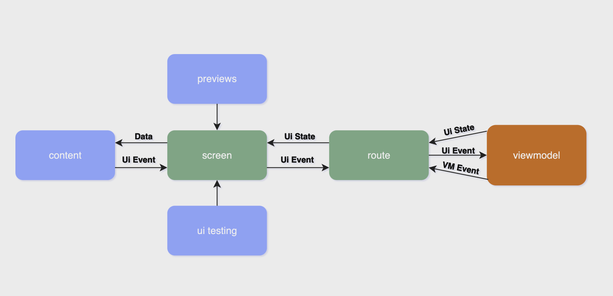

## Component - Screen - ViewModel

Taking `products-list` feature as example:

### ProductsListViewModel

1. Contains the uiState state flow and the vmEvent channel to communicate with the view

```kotlin
private val _uiState: MutableStateFlow<ProductsListUiState> = MutableStateFlow(ProductsListUiState.Loading)
val uiState: StateFlow<ProductsListUiState> = _uiState.asStateFlow()

private val _vmEvent = Channel<ProductsListVMEvent>()
val vmEvent: Flow<ProductsListVMEvent> = _vmEvent.receiveAsFlow()
```

2. Reacts to ui events coming from the screen

```kotlin
fun onAddProductToCartClick(productCode: String) {
    viewModelScope.launch {
        try {
            cartRepository.addProduct(productCode = productCode)
            _vmEvent.send(ProductsListVMEvent.ShowProductAddedToCartSuccess)
        } catch (ex: Exception) {
            if (ex is CancellationException) throw ex
            _vmEvent.send(ProductsListVMEvent.ShowProductAddedToCartError)
        }
    }
}
```

### ProductsListRoute

1. It injects the viewmodel
   
```kotlin
@Composable
fun ProductsListRoute(
    viewModel: ProductsListViewModel = hiltViewModel(),
)
```
2. Receives the ui state from the viewmodel and propagates it to the screen
   
```kotlin
val uiState by viewModel.uiState.collectAsStateWithLifecycle()

...

ProductsListScreen(
    uiState = uiState,
    ...
)
```
3. Receives one time events from the viewmodel and reacts to them

```kotlin
EventObserver(
    flow = viewModel.vmEvent,
) { event ->
    when (event) {
        ...
    }
}
```

4. Receives and manages the ui events sent by the screen.

```kotlin
val uiEvent = rememberUiEvent<ProductsListUiEvent> { action ->
    when (action) {
        ...
    }
}
```
I like to pass a single onUiEvent lambda to the screen to avoid overloading the composable function parameters.
```kotlin
ProductsListScreen(
    ...
    onUiEvent = uiEvent,
)
```

### ProductsListScreen

1. The screen is the composable that I use for previews and testing.

It doesn't have a dependency on the viewmodel, so the preview works and the testing is straightforward because I can pass the state that I want to test.

```kotlin
@Composable
@VisibleForTesting
internal fun ProductsListScreen(
    uiState: ProductsListUiState,
    onUiEvent: (ProductsListUiEvent) -> Unit,
    ...
)
```

2. I also use a [Screen](core/designsystem/src/main/kotlin/com/jargcode/storechallenge/core/designsystem/components/content/Screen.kt) wrapper, so if I decide to replace Material 3 with another container instead of a Scaffold in the future, I’ll only need to refactor one composable.

```kotlin
Screen(
    ...
) {
    ...
}
```

3. Screen wrapper contains and displays the content of the screen based on the viewmode ui state. It also pass the uiEvent lambda.

```kotlin
ProductListContent(
    modifier = Modifier
        .fillMaxSize()
        .testTag(stringResource(R.string.product_list_content_test_tag)),
    products = products,
    onUiEvent = onUiEvent,
)
```

4. Screen content send uiEvents to the route, which reacts to this events

```kotlin
onAddToCartClick = {
    onUiEvent(OnAddProductToCartClick(productId = product.code))
}

is OnAddProductToCartClick -> {
    viewModel.onAddProductToCartClick(productCode = action.productId)
}
...
